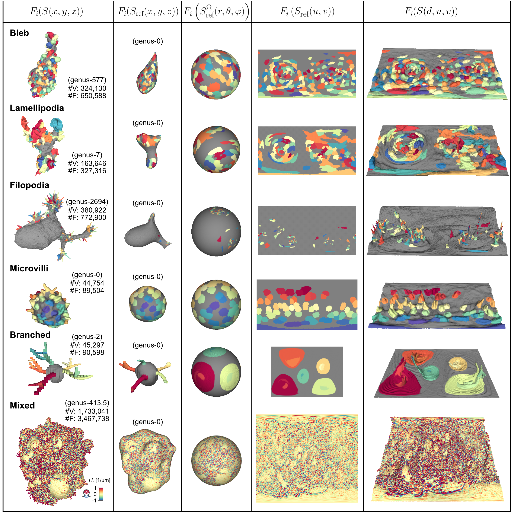

# u-unwrap3D
## Library for 3D Surface-guided computing
<p align="center">
  
</p>

#### April 10, 2023
u-unwrap3D is a Python library of functions designed to map 3D surface and volume data into different representations which are more optimal for the desired computing task. For example it is far easier to track surface features on the 3D sphere or 2D plane. Similarly the 3D reference surface enables comparison of global shape across cells and the topography surface specifically highlight surface protrusions. We pay particular attention to minimize conformal and equiareal distortion errors and avoid surface-cutting and restitching. The representations were chosen to preserve the full surface and simplify downstream quantitative characterization of surface features with particular attention to single cell biology.

It is associated with the paper currently under review, [**Surface-guided computing to analyze subcellular morphology and membrane-associated signals in 3D**](https://doi.org/10.1101/2023.04.12.536640), *bioRxiv*, 2023, written by Felix Y. Zhou, Andrew Weems, Gabriel M. Gihana, Bingying Chen, Bo-Jui Chang, Meghan K. Driscoll and [Gaudenz Danuser](https://www.danuserlab-utsw.org/).


## Example of u-unwrap3D applied to complex cell surfaces
u-unwrap3D can handle a large variety of input surfaces. A key motivation of this work was to allow the mapping of high-genus cell surfaces that are common when meshing binary cell segmentations from microscopy. Here are some examples of the surfaces we can map. More detailed characterization is included in our paper.
<p align="center">
  
</p>

## Library Features
u-unwrap3D is a library motivated by scipy / numpy / opencv that provides re-usable functions that can be used to build-up complex processing pipelines. Whilst its primary motivation is to provide mesh and image processing functions for handling 3D geometry and surfaces, it does also include a plethora of functions associated with preprocessing/postprocessing and analysis. All the functions are organized into submodules related to the high-level task they associated with e.g. mesh processing, registration, file handling, geometry etc. A brief summary is provided below. The detailed functions can be found from the mainpage of the documentation in this repository, docs/build/html/index.html or directly docs/build/html/py-modindex.html.

|Module                   |Functionality|
|-------------------------|-------------|
|Analysis_Functions       | Functions for analyzing topographic representation (mapping to Cartesian coordinates, watershed depth propagation) and timeseries (cross-correlation)|
|Features                 | 2D SIFT features extractor  |
|Geometry                 | Functions for computing 3D geometric transformations of points e.g. rotating points, steregraphic mapping 3D sphere to 2D plane |
|Image_Functions          | Functions for general image manipulation e.g. interpolation, intensity normalization|
|Mesh                     | Functions for mesh processing, e.g. conformalized mean curvature flow, mesh propagation, conformal, equiareal error computation, area-distortion relaxation, voxelization, reading/writing meshes|
|Parameters               | Defining default parameters for e.g. 3D demons registration, 2D optical flow|
|Registration             | Volumetric registration through SimpleITK and wrappers for Matlab|
|Segmentation             | Functions for working with segmentation e.g. morphological operations, threshold-based segmentation, signed distance transform, mean curvature|
|Tracking                 | 2D optical flow, 2D optical flow assisted bounding box tracker |
|Unzipping                | Functions for working with image-based uv-parameterized surfaces, e.g. surface propagation, conformal/equiareal distortion measures, spherical boundary padding |
|Utility_Functions        | Functions for file manipulation e.g. folder creation, reading image formats|
|Visualisation            | Functions for plotting e.g. colormapping numpy arrays, forcing equal aspect ratio for matplotlib 3D plotting |

## Getting Started
The simplest way to get started is to check out the included notebooks which walks through the steps described in the paper for obtaining all representation starting from step0: the extraction of surface from a binary cell segmentation.

## Dependencies
u-unwrap3D relies on the following packages for various functionalities. All can be readily installed using conda or pip. Not all needs to be installed. Feel free to install as needed / when an error is thrown. The key ones are below:
- [libigl](https://libigl.github.io/libigl-python-bindings/tut-chapter0/) - `conda install -c conda-forge igl` : for mesh processing
- [trimesh](https://trimsh.org/) - `pip install trimesh` : for mesh io and processing
- [pyacvd](https://pypi.org/project/pyacvd/) - `pip install pyacvd` : for isotropic remeshing
- [transforms3d](https://pypi.org/project/transforms3d/) - `pip install transforms3d` : for 3D coordinate transforms 
- [numpy](https://numpy.org/) - `pip install numpy` : for general computing
- [scipy](https://www.scipy.org/) - `pip install scipy` : for image filtering, transformations and sparse linear algebra
- [scikit-image](https://scikit-image.org/) - `pip install scikit-image` : general image processing
- [matplotlib](https://matplotlib.org/) - `pip install matplotlib` : general plotting 
- [opencv](https://pypi.org/project/opencv-contrib-python/) - `pip install opencv-contrib-python` : for optical flow tracking, inpainting, various image processing
- [tqdm](https://tqdm.github.io/) - `pip install tqdm` : for progressbar

More optional / certain functions:
- [SimpleITK](https://simpleitk.org/) - `pip install SimpleITK` : for optional volumetric registration
- [point-cloud-utils](https://github.com/fwilliams/point-cloud-utils) - `pip install point-cloud-utils` : for computing point cloud metrics
- [optimesh](https://pypi.org/project/optimesh/) - `pip install optimesh` : for delaunay triangle flipping, remeshing for relaxing area-distortion on 2D disks
- [robust-laplacian](https://pypi.org/project/robust-laplacian/) - `pip install robust-laplacian` : for using the robust laplacian of Sharpe et al. instead of cotangent Laplacian 
- [pygeodesic](https://pypi.org/project/pygeodesic/) - `pip install pygeodesic` : for fast Djikstras algorithm for computing exact geodesic distance on triangle meshes
- [potpourri3d](https://github.com/nmwsharp/potpourri3d) - `pip install potpourri3d` : for using heat method to compute approximate geodesic distance on triangle meshes with multiple sources

## Installation
The above dependencies and library should be installable by git cloning the repository and running pip in the cloned folder with python>=3.8
```
pip install .
```

## New functionality
New tools will be added to improve useability and applicability. In particular we plan to introduce mesh repair and surgery techniques to guarantee the creation of a surrogate genus-0 surfaces of any input genus-X surface.

## Questions and Issues
Feel free to open a GitHub issue or email me at felixzhou1@gmail.com.

## Danuser Lab Links
[Danuser Lab Website](https://www.danuserlab-utsw.org/)

[Software Links](https://github.com/DanuserLab/)